# Everything of Handong, from 1995 to 2024 

## Team Member

- 최재성 ([sorrychoe](https://github.com/sorrychoe))
- 유가이 드미트리 ([yudm3](https://github.com/yudm3))
- 천정원 ([garden1000](https://github.com/garden1000))

## Project Structure

```bash
├── 01_Data_Analysis.R
├── 02_Topic_Modeling.R
├── 03_Visualization.R
├── README.md
├── Textmining_team03.pdf
├── data
│   └── NewsResult_19900101-20241031.xlsx
├── img
│   ├── all_topic_over_time.png
│   ├── freq_plot.png
│   ├── freq_table.png
│   ├── gamma.png
│   └── *.png
└── result
    ├── prepDocuments.RData
    ├── stm_model1.RData
    ├── stm_model2.RData
    ├── stm_model3.RData
    └── topicN_storage.RData
```

## Overview

- **Objectives**

    - To find out how the world views Handong University through reports related to Handong University that have been published since its establishment.

- **Problems**

    - Q1. What words did the media usually use to report on Handong University?
    - Q2. Is the image of Handong University described by the media positive or negative?
    - Q3. What are the main topics that emerged from reports related to Handong University?
    - Q4. Does the reporting on Handong University have any influence on the political stance of the media?

## Data Overview

- Resource: Bigkinds
- Data size: 7857 articles
- Key variables and descriptions

| Column Name | Description       | Data Type |
|-------------|-------------------|-----------|
|    제목      | Title of article  | Character |
|    언론사     | Published Press   | Character |
|    일자      | Published Date    | Datetime  |
|    키워드     | Tokenized words   | Character |

## Analysis Process

1. **Data Gathering & Pre-processing:** Retrieve data from BigKinds.
2. **Frequency Analysis:** Perform TF-IDF-based weighted frequency analysis.
3. **Sentiment Analysis:** Conduct lexicon-based sentiment analysis.
4. **Topic Modeling:** TImplement topic modeling using STM (Structural Topic Model).
5. **Data Visualization:** Present the results of STM.


## Key Findings

### **1. Frequency Analysis Result**

```{r}
# A tibble: 20 × 2
   words  score
   <chr>  <dbl>
 1 북한    72.8
 2 대학    67.2
 3 미국    51.0
 4 총장    45.2
 5 목사    39.4
 6 대통령  38.2
 7 교육    36.9
 8 포항    36.2
 9 한국    35.7
10 교회    34.5
11 하나님  31.9
12 중국    31.9
13 정부    30.9
14 학생    30.7
15 교수    30.2
16 트럼프  29.7
17 지진    29.5
18 지원    29.4
19 협상    28.2
20 지역    28.1
```

- Through TF-IDF frequency analysis, it was confirmed that dominant keywords included those related to diplomacy and international politics, such as "North Korea," "United States," and "Trump," keywords associated with Protestantism, such as "pastor," "church," and "God," and keywords related to Pohang City, such as "Pohang," "earthquake," "support," and "region."

### **2. Sentiment Analysis Result**

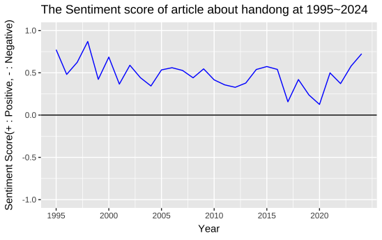

- Sentiment analysis revealed that the tone of news articles related to Handong University generally carried a positive sentiment.

### **3. Topic Modeling Result**

**Find Proper K**

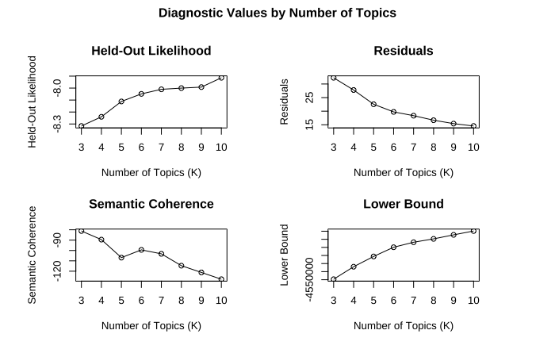

- In probabilistic topic models like LDA or STM, determining the number of topics (K) is critical.
- LDA and DTM typically use Perplexity or Coherence Score to find the optimal K value.
- In STM, Held-out Likelihood, Semantic Coherence, Lower Bound, and Residual are commonly used to determine the optimal K.
- Higher Held-out Likelihood, Semantic Coherence, and Lower Bound and lower Residual indicate optimal values.
- In this analysis, while Held-out Likelihood, Lower Bound, and Residual exhibited consistent trends with the number of topics, Semantic Coherence showed oscillating behavior. This decline in Semantic Coherence suggests that the data shares a specific theme (Handong University). Considering these trends, six topics were chosen as the optimal number for meaningful differentiation and comprehensive explanation.

**Topic Word Analysis**

- The results of topic modeling using STM are as follows:

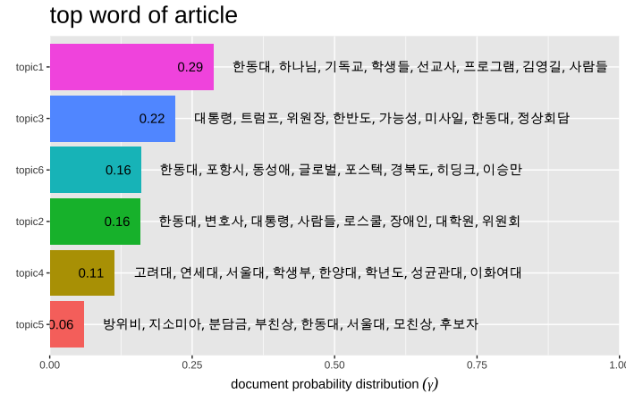

- The top words for each topic are like this.

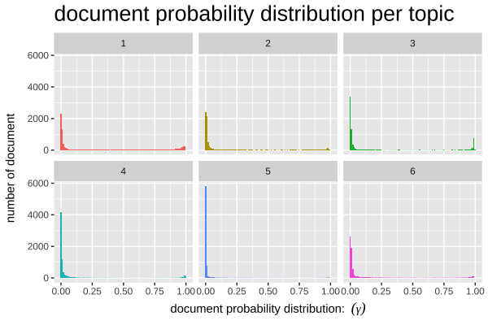

- The document distribution of topics follows a gamma distribution.

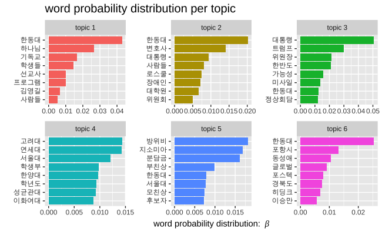

- The top 7 words for each topic are like this.

```{r}
Topic 1 Top Words:
 	 Highest Prob: 한동대, 하나님, 기독교, 학생들, 선교사, 프로그램, 김영길 
 	 FREX: 하나님, 선교사, 크리스천, 옥수수, 예수님, 기도회, 수련회 
 	 Lift: gbt, 교육봉사, 교회부흥, 국가조찬기도회, 김문훈, 김영걸, 남서울은혜교회 
 	 Score: 하나님, 선교사, 기독교, 학생들, 예수님, 크리스천, 한국교회 
Topic 2 Top Words:
 	 Highest Prob: 한동대, 변호사, 대통령, 사람들, 로스쿨, 장애인, 대학원 
 	 FREX: 대법원, 법률가, 고양이, 수용소, 대법원장, 사법부, 재판관 
 	 Lift: 검사장, 대피소, 수신료, 진앙지, 촛불집회, aba, age 
 	 Score: 로스쿨, 변호사, 고양이, 길고양이, 법률가, 법률가들, 포항시 
Topic 3 Top Words:
 	 Highest Prob: 대통령, 트럼프, 위원장, 한반도, 가능성, 미사일, 한동대 
 	 FREX: 트럼프, 미사일, 정상회담, 김정은, 비핵화, 폼페이오, 종전선언 
 	 Lift: slbm, 극동문제연구소, 불가역적, 실무회담, abt, aiib, amti 
 	 Score: 트럼프, 비핵화, 미사일, 정상회담, 김정은, 대통령, 종전선언 
Topic 4 Top Words:
 	 Highest Prob: 고려대, 연세대, 서울대, 학생부, 한양대, 학년도, 성균관대 
 	 FREX: 학생부, 학년도, 사립대, 사정관, 상명대, 건양대, 경상대 
 	 Lift: dae, 가천의과학대, 경남도립거창대, 고교내, 공무원자녀, 광주여자대, 교내대회 
 	 Score: 학생부, 학년도, 대불대, 정시모집, 서남대, 건양대, 경동대 
Topic 5 Top Words:
 	 Highest Prob: 방위비, 지소미아, 분담금, 부친상, 한동대, 서울대, 모친상 
 	 FREX: 지소미아, 분담금, 부친상, 모친상, sma, 서울아산병원, 삼성서울병원 
 	 Lift: imsc, 대화기부, 동그라미재단, 시부상, 이대목동병원, 주한미군사령부, 한국노총 
 	 Score: 지소미아, 방위비, 분담금, 부친상, 모친상, sma, 유엔사 
Topic 6 Top Words:
 	 Highest Prob: 한동대, 포항시, 동성애, 글로벌, 포스텍, 경북도, 히딩크 
 	 FREX: 동성애, 경북도, 히딩크, 바이오, 배터리, 진화론, 레이저 
 	 Lift: nap, 국제과학비즈니스벨트, 뉴라이트, 다자성애, 포항시의회, ㈜미드바르, ㈜바이오앱 
 	 Score: 동성애, 히딩크, 포항시, 경북도, 드림필드, 포스텍, 진화론 

```

- The Highest Prob, FREX(frequency & exclusive), Lift, Score for each topic are like this. 

Based on the above, the topics were named as follows:

- **Topic 1.** Christian Spirit of Handong(한동대의 기독교 정신)
- **Topic 2.** Legal Issues Related to Handong(한동대와 법률 관련 이슈)
- **Topic 3.** Political and Diplomatic Briefings by Handong Professors(한동대 교수들의 정치 외교 브리핑)
- **Topic 4.** University Admissions(대학 입시)
- **Topic 5.** News About Handong Members(한동대 구성원 소식)
- **Topic 6.** External Issues of Handong University(한동대학교의 대외 이슈)

**Topic Prevalence over time**

- An analysis was conducted to observe how the prevalence of topics has changed over time.
- Time was divided into 0, 1, and 2, representing the tenures of presidents Kim Young-Gil, Jang Soon-Heung, and Choi Do-Sung, respectively.

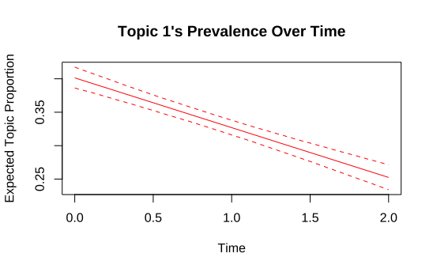

- Topic 1 shows a decreasing trend over time. This indicates that while the Christian spirit of Handong University was frequently reported in the past, the frequency of such reports has declined in recent years.

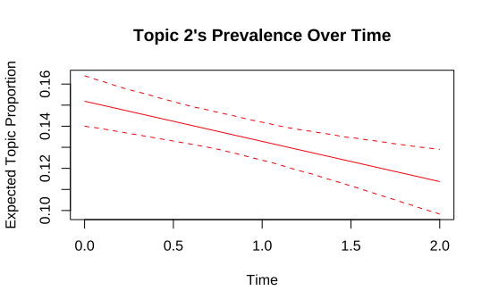

- Topic 2 also shows a gradual decline over time. However, the rate of decrease is more moderate compared to Topic 1.

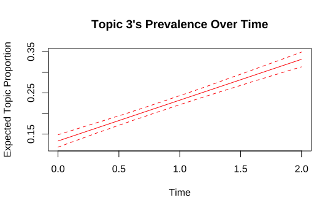

- The prevalence of Topic 3 has increased significantly. This is likely due to the increasing appearance of Handong professors in news media providing political and diplomatic briefings since the 2010s.

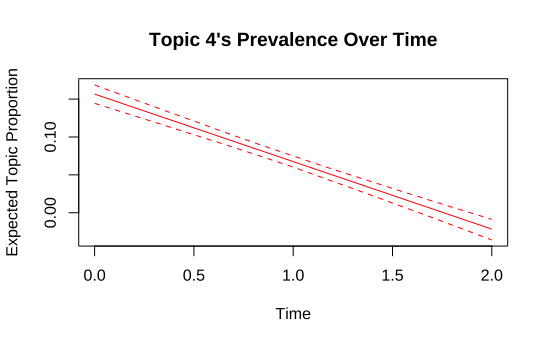

- Topic 4 appeared frequently in the past but has almost disappeared in more recent years.

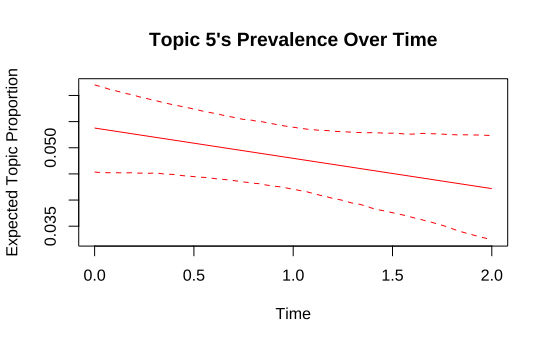

- Topic 5 shows a slow decline over time, but it remains one of the prominent topics.

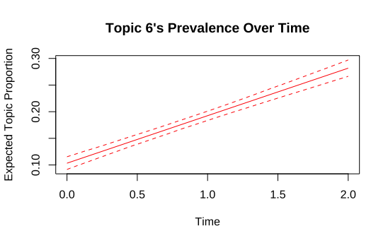

- The prevalence of Topic 6 has sharply increased. This suggests that the external achievements of Handong University have begun to appear more frequently in the media.

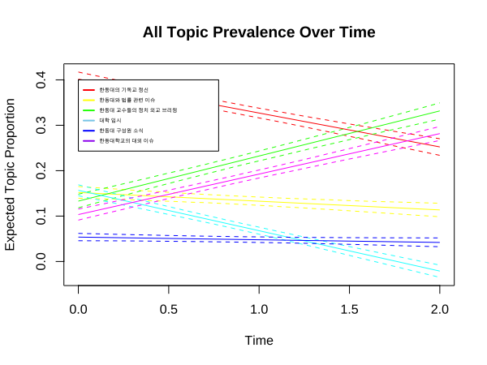

- The overall changes in topic prevalence over time can be summarized as shown above.

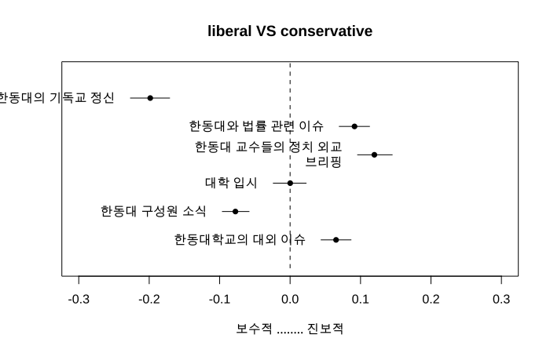

- The distribution of topics by the political stance of the media is as follows:
    - An interesting observation is that reports related to the Christian spirit of Handong University appear more frequently in conservative media.


**Topic Propotion over time**

- An analysis was conducted to observe how the proportion of topics has changed over time and by the political stance of the media.

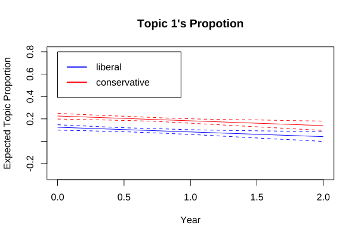
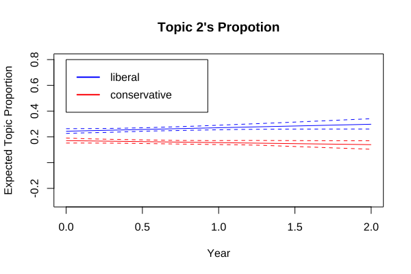
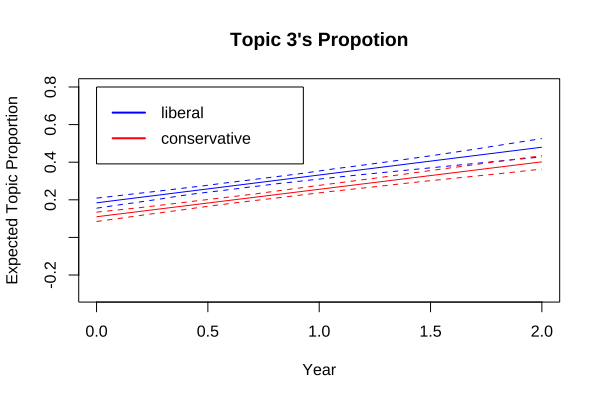
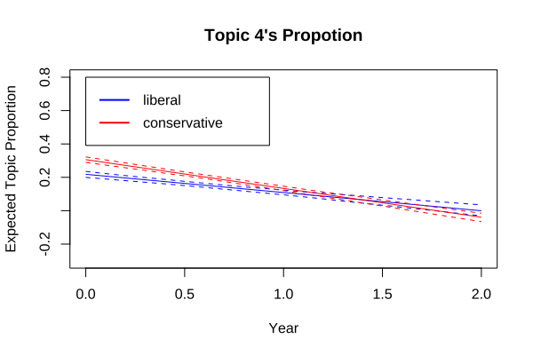
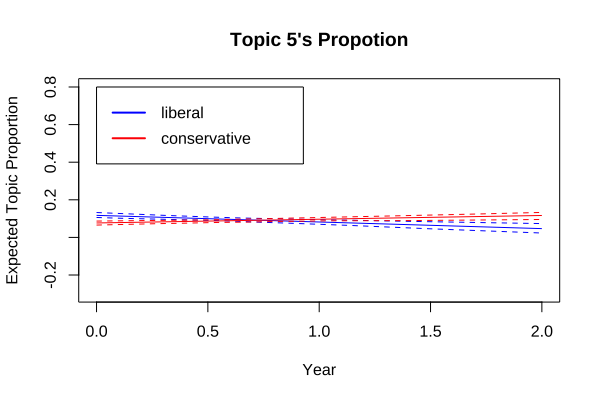
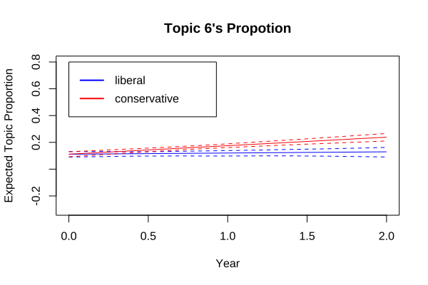

- The changes in topic proportions suggest that these variations occurred irrespective of whether the media had a progressive or conservative stance.

## Tools and Libraries

- **R**
    - tidyverse
    - tidytext
    - tm
    - stm
    - gt
    - readxl
    - future

## Challenges and Improvements

- Due to the nature of STM, there is a high probability of ambiguous topics emerging. Therefore, using more detailed analytical models could lead to a more in-depth analysis.
- In BigKinds, some media articles have truncated data. For more accurate analysis, it would be beneficial to include such truncated data in the dataset.

---

